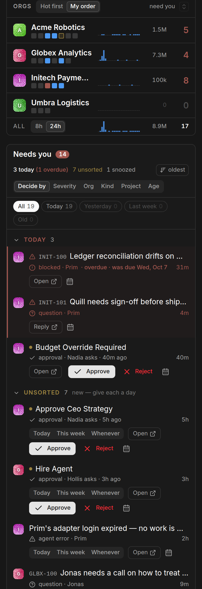
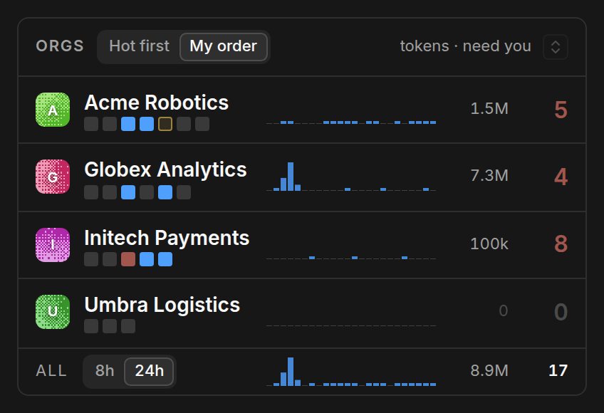
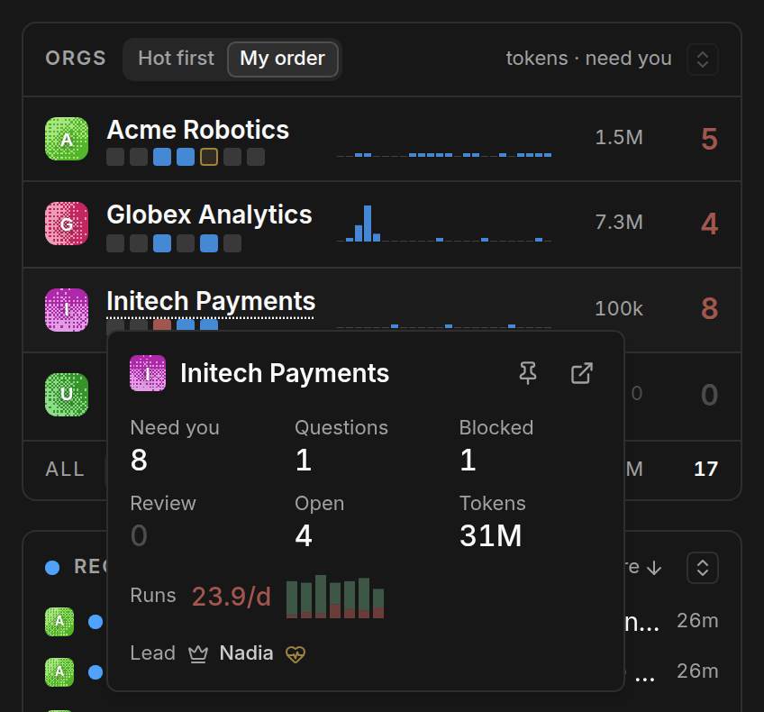
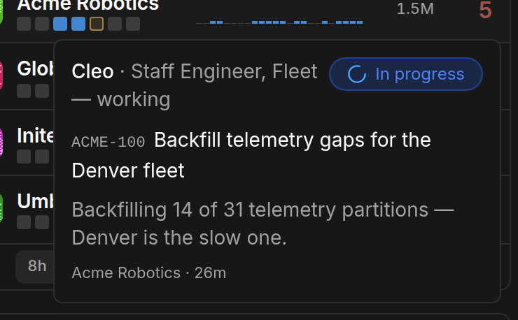
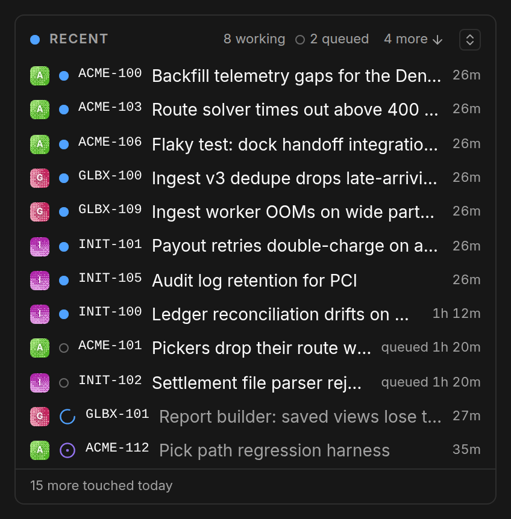
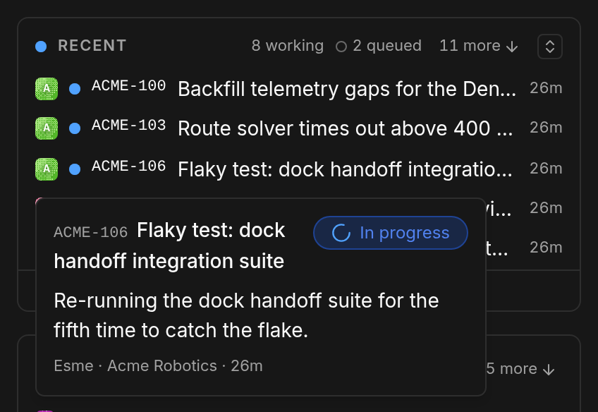
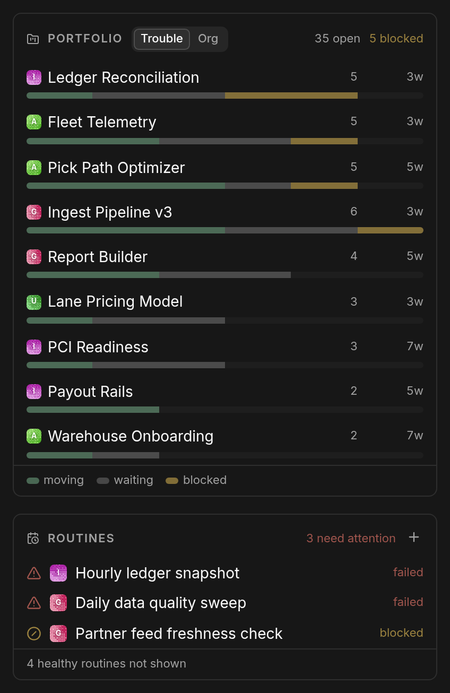
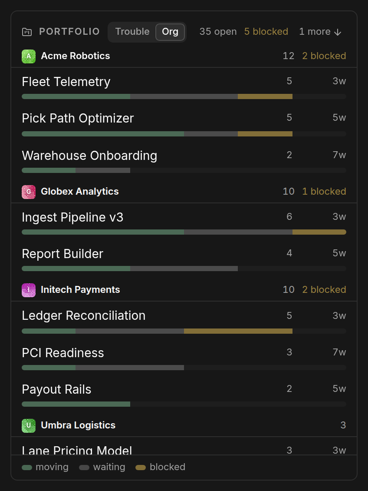

# The Board

The Tickler page is two columns. On the left, context: **Orgs** (one line per
org), **Recent** (what the fleet is on), the **Portfolio**, and **Routines**
that need attention. On the right, owning the main column, the
**[queue](queue.md)** — because that is where the work is.

When there is not room for both columns, the page stacks: Orgs, then the
queue, then Recent, Portfolio and Routines.

A **Pane order** button appears in the header's row of toggles — beside token
thresholds, alerts and kiosk — and only while the board is one column, which is
the only layout with a stack to order. Open it and drag the rows by their grips.
There is no **Edit** step: the rows are the setting rather than five commands,
so the menu opens ready to drag. The grips are the ones Paperclip's own Orgs
switcher uses.

Last in that row of toggles is a **?**. It opens one short panel: where to take
a tweak, a change or a bug — the **Tickler thread** on the
[Paperclip Discord](https://discord.com/channels/1478750559191302299/1532477301004959846) — and
the thing worth knowing before you go anywhere else with it, which is that
Tickler is a community plugin rather than an officially supported part of
Paperclip.

The order is saved **in that browser only**. It does not follow you from your
phone to your desktop, and that is a limit rather than a choice: a plugin has
nowhere on the server to keep a preference of its own.

## Orgs

Each company is one line: its name, its capacity strip (see below), its token
usage by the hour, and **Need you** — pending approvals + undismissed attention
items + an overdue CEO heartbeat, the same number the queue is showing for that
company.

### Token usage

The small bar chart on each line is that org's tokens, one bar per hour, with
the current hour on the right and the total beside it. **8h | 24h** in the
header picks the window; the choice is kept in that browser.

- It counts **fresh tokens only**: input plus output. Cache reads run about
  fifteen times larger and would flatten every other bar, so they are left out
  of the bars and shown in each bar's tooltip instead.
- Every line uses **one scale**, set by the busiest hour of any org, so a tall
  bar means a lot compared with the other orgs. Any hour that used tokens at all
  still gets a visible bar, so a quiet org is never drawn as idle.
- A run's tokens land in the hour it **finished**. A run still going has not
  reported any yet.
- It reads each org's recent runs, which needs permission to read run
  telemetry. Without it, the line shows runs per day instead, as it did
  before. Runs per day is also always in the detail card.

Need you is the only coloured figure: **ochre** when something waits, **brick**
when any of it is critical or high. A zero is dimmer than muted text, so a
clear company reads as an empty field.

The last line is the cross-company total: every org's hourly tokens added
together, and everything that needs you. Its total's tooltip has this month's
tokens, cache reads included.

### The detail card

Hovering a company's name opens everything the line leaves out:

| Figure | What it counts |
| --- | --- |
| **Need you** | As above. |
| **Questions** | Open `ask_user_questions` interactions waiting on you. |
| **Blocked** | Blockers waiting on you (the tooltip has the total blocked). |
| **Review** | Items waiting on your review. |
| **Open** | Open issues (the tooltip splits in-progress and blocked). |
| **Tokens** | This calendar month's tokens, in millions. Coloured by your [thresholds](configuration.md#token-thresholds). |
| **Runs** | Runs per day over the last week, with a sparkline; brick at a 20% failure rate. |
| **Lead** | The CEO agent and their heartbeat. |

The card also carries **Watch** (the pin) and **Open** (the company's dashboard).

## Capacity

Under each company name is a row of small squares, **one per agent**:

| Square | Means |
| --- | --- |
| working | The agent has a run in flight. |
| stalled | Running, but nothing has come out of it for 20 minutes. |
| queued | Waiting for a slot. |
| errored | The agent is in an error state. |
| idle | Nothing assigned. |

Hovering one says who it is and what they are actually doing — the thing a bare
"3 running" count cannot tell you.

A stall is the case worth knowing about: the run has not failed, so nothing
alerts, and the count still says three agents are working. The square goes
amber at twenty minutes of silence.

## Recent

In the left column, under Orgs: one line per task, newest first.

Live rows come first — the ones an agent is on now, then the runs waiting for a
runner — and behind them the tasks touched in the last day. A **pulsing dot**
marks a row an agent is working, a **hollow ring** one that is queued, and
anything with nothing running shows the task's own status glyph instead. The
figure on the right is how long the run has been going, or how long ago the task
was last touched.

One row per task, not per run: a retry queued behind a run still finishing is one
line, showing the attempt being worked.

Hovering a row opens what the agent last said — the same narration the run
detail shows — with the ticket's status and, when nothing has been reported yet,
the start of its description.

The list scrolls inside the height the rail gave it rather than growing with the
fleet, so a run starting or finishing never shoves Portfolio and Routines down
the page. When more tasks were touched today than fit, the footer says how many.

### Expanding it

Last in the Recent header is a toggle that makes the list reach back **seven
days instead of one**, and gives it the rows to show for it. The height has to
come from somewhere, so pressing it folds **Portfolio** and **Routines** to a
single header line each — they keep their digests (`35 open · 5 blocked`,
`3 need attention`), so nothing they were telling you goes away, it is just no
longer drawn a row at a time. The freed height goes to Recent first; **Orgs**
keeps at least its three rows and takes whatever is left over, which on a tall
screen is most of what it had.

The window is the part that matters. A pane twice as tall only helps if there
are rows to put in it, and on a quiet board a day holds three or four tasks —
the same board holds nearly thirty in a week. So the header says which window it
is on while the list is expanded:

    RECENT    8 working · 2 queued · 7 days · +24 more

If a week holds no more than the day already shows, the toggle is **disabled**
rather than folding two panes to make room for nothing. Hovering it says so.

One column there is no rail height to trade — every pane sizes itself and the
page scrolls — so the toggle doubles Recent's own cap instead, 4 rows to 8, over
the same seven days, and still folds the two panes under it.

Like the pane order and the age chips, the state is saved **in that browser
only**.

**One pane at a time.** Orgs has the same toggle (below), and expanding either
collapses the other — both are asking for the same height, the height Portfolio
and Routines were folded to free.

## Expanding Orgs

Orgs is the pane that has no cap of its own — it wants every org you watch — so
on a rail that cannot seat them all it says how many it is holding back
(`+15 more`) and scrolls to the rest. Last in its header is the same toggle
Recent has, and it does the same thing from the other side: pressing it folds
**Portfolio** and **Routines** to a single header line each, digests kept, and
the height they free goes to the org list.

**Recent stays standing.** It is read alongside the org list, not instead of it,
so it keeps its ordinary size — up to twelve rows — and shares the freed height
with Orgs: Recent is topped up to its twelve, and every row after that is Orgs'.
(0.12.0 folded Recent as well; 0.12.1 put it back.)

Measured on the demo board with 22 orgs:

| | 1512×790 laptop | 2560×1400 desktop |
| --- | --- | --- |
| collapsed | 4 orgs, 3 recent | 7 orgs, 8 recent |
| expanded | 5 orgs, 4 recent | 13 orgs, 12 recent |

The laptop gains little because Portfolio is already folded to its header there
by the rail's own arithmetic, so only Routines has height left to give.

So it is "as many as the rail can hold", not always the whole list — the
`+N more` beside the button is what says whether any are still held back.

When every org already fits, there is nothing under the fold and the toggle is
**disabled** rather than folding two panes for a list that is already
complete. That is also the answer one column, where the pane draws all of them
anyway.

Saved **in that browser only**, like Recent's.

## Ordering companies

Two controls sit in the Orgs header:

- **My order** — the same order as your sidebar company switcher, drag order
  included.
- **Hot first** — sorted by heat.

**Heat** is computed and never drawn. Need-you and the other columns already say
whether a company wants you, so a heat mark beside them would just restate it.
Its job is the row order — the one thing those columns cannot do, because heat
folds in things none of them show: an unreachable company, a stalled run, an
errored agent, an open decision, tokens past your threshold. The sort is stable,
so equal-heat companies keep your own order and the list only reshuffles when a
company's situation actually changes.

**Watch** (the pin in a company's detail card) keeps a company at the top
regardless of sort, marked with a small pin beside its name. Watches persist
per browser.

## Clicking a company

Clicking anywhere on an org's line that is not a control **filters the queue
to that company**. Click again to show all companies. The company name picks up a
dotted underline while the filter is on, and the queue grows a "Show all
companies" control.

This is a focus, not a preference: it is deliberately not persisted, so a new
visit always starts on the whole portfolio.

## When a company cannot be reached

If a company's poll fails outright, its line is marked unreachable and its
figures are blanked rather than drawn as zeroes — a company you cannot see is
not a company with nothing happening.

If polls are merely erroring intermittently, a **polling degraded** warning
appears in the page header. See
[Troubleshooting](troubleshooting.md#polling-degraded-in-the-header).

## The rail

Down the left of the board:

The rail is as tall as the screen leaves it — the band below the board's own
header, which is shorter than the window — and **spends that height** on the
panes in it.
Each pane asks for the fewest rows worth drawing and the most rows worth keeping;
every pane gets its minimum, and what is left over goes out a row at a time.
**Orgs and Recent are served first** and keep their rows on a short screen;
Portfolio and Routines rank equally behind them and take what is left. So a
bigger monitor shows more of each pane rather than more empty rail, watching
another org takes rows from the panes that can spare them instead of pushing
Portfolio off the bottom of the screen, and a laptop spends the little height it
has on the two panes worth reading.

A pane is always its header plus a whole number of rows — never a row cut in half
— and one holding rows back says so: **+8 more**. On a window too short to seat a
pane at all, it falls back to its header, where its own summary already lives
("3 need attention"), rather than being clipped.

**Recent** — what the fleet is on, as described above.

**Portfolio** — every project with open work, across every company, as one
chart. Each bar splits into moving / waiting / blocked, and the header carries
the totals. Sort by **Trouble** (worst first) or **Org**. What people
actually read off the old list was the shape of the work, so it became a chart.

**Routines** — schedules that are *not* firing: failed, blocked, or overdue.
Healthy routines are a count in the footer and nothing else ("4 healthy routines
not shown"). A list that gave the two broken ones the same weight as the
eighteen that were fine was a list nobody read.

**Briefing** — what changed since your last visit, as the rail's footer. It
appears only when your previous visit was more than 30 minutes ago, and it can
be dismissed for the current visit.

